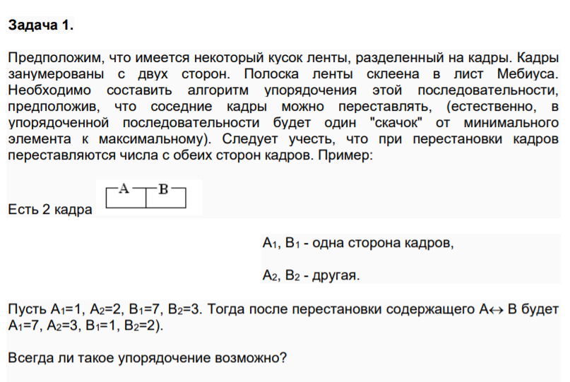

# Занятие 9 (01.12.2021) - в аудитории
### 1. Разбор задачи на акции
* Идейно разобрали задачу нахождения "longest increasing subarray"
* Рассмотрели как сделать её с помощью циклов
* Посмотрели как выгрузить акцию с финама
* Подводные камни загрузки Excel файла в R
### 2. Разбор личной задачи №1
* Постановка задачи
* Что такое лист Мебиуса
* Идея решения
* Смотрим в R

Условие задачи №1:

